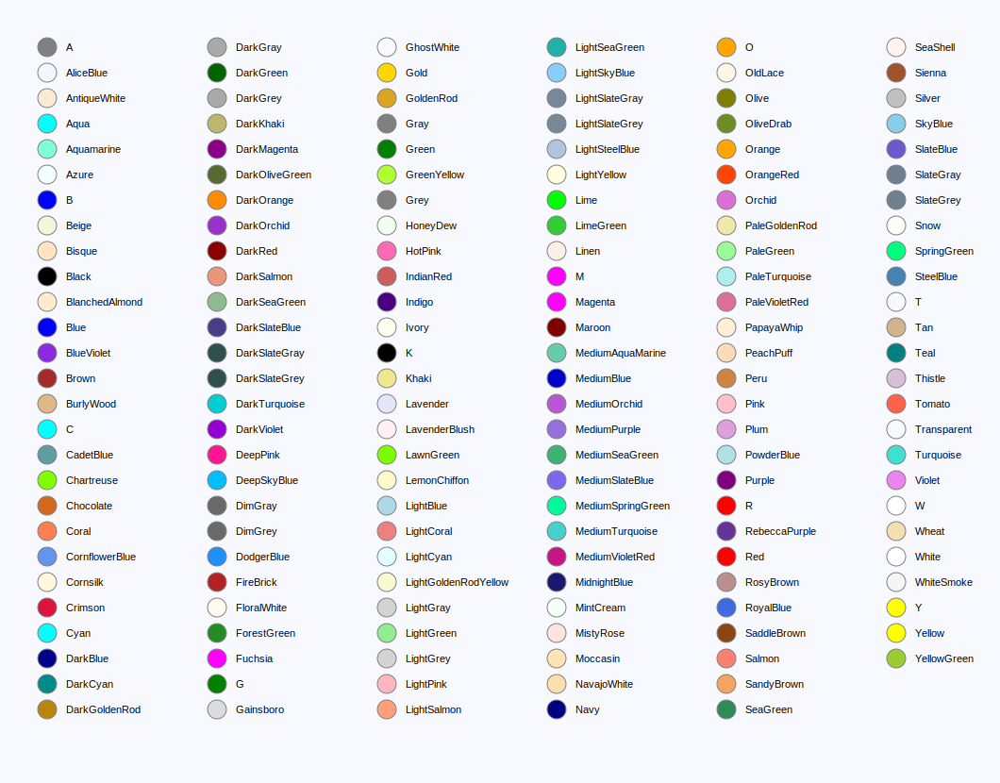
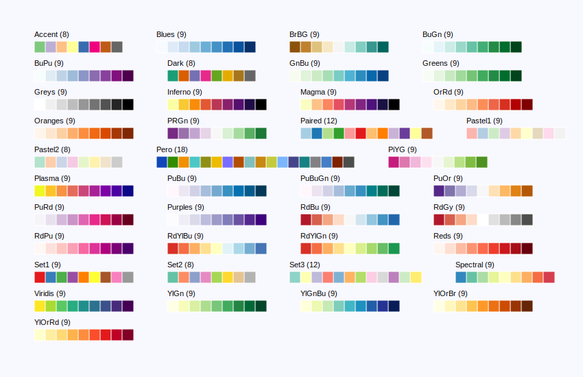
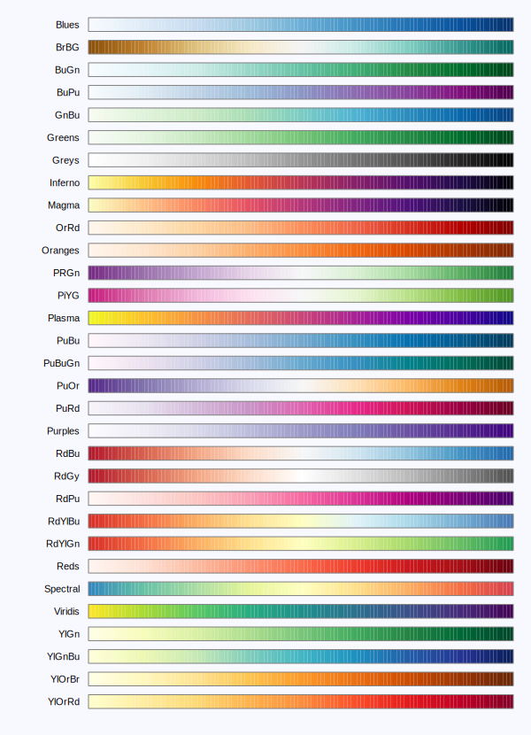

# Colors, Palettes and Gradients

## Main Classes

- [pero.Color](#Color)
- [pero.Palette](#Palette)
- [pero.Gradient](#Gradient)

## Libraries

- [pero.COLORS](#COLORS)
- [pero.PALETTES](#PALETTES)
- [pero.GRADIENTS](#GRADIENTS)


### <a id="Color" href="#Color">#</a> pero.Color(*args, name=None)

Represents a color defined by red, green, blue and alpha channels. Those can be specified individually, as tuple or list
or using hex code string. In addition, a unique name can be specified to register new color within colors library.

- **args:** *(int, int, int) or (int, int, int, int) or str*  
  Red, green, blue and alpha channel as a values in range 0 to 255 or hex code string.

- **name:** *str* or *None*  
  If the name is provided, it is used to register the color in the *[pero.COLORS](#COLORS)* library.

```python
import pero

# by individual channels
color = pero.Color(255, 165, 0, 255, name="Orange")
color = pero.Color(255, 165, 0)

# by channels tuple
color = pero.Color((255, 165, 0, 255), name="Orange")
color = pero.Color((255, 165, 0))

# by hex code
color = pero.Color('#ffa500ff')
color = pero.Color('#ffa500')

# by name
color = pero.Color.Orange
color = pero.COLORS.Orange
```

#### Properties

- **name** -> *str* or *None*  
  Gets the color name or *None* if note set.

- **red** -> *int*  
  Gets red channel as a value in range 0 to 255.

- **green** -> *int*  
  Gets green channel as a value in range 0 to 255.

- **blue** -> *int*  
  Gets blue channel as a value in range 0 to 255.

- **alpha** -> *int*  
  Gets alpha channel as a value in range 0 to 255 where 0 means fully transparent and 255 fully opaque.

- **rgba** -> *(int, int, int, int)*  
  Gets RGBA channels tuple where each channel is defined as integer in range 0 to 255.

- **rgb** -> *(int, int, int)*  
  Gets RGB channels tuple where each channel is defined as integer in range 0 to 255. This might me useful to implement
  backends not supporting color transparency.

- **rgba_r** -> *(float, float, float, float)*  
  Gets RGBA channels tuple where each channel is defined as float in range 0 to 1.

- **rgb_r** -> *(float, float, float)*  
  Gets RGB channels tuple where each channel is defined as float in range 0 to 1.

- **hex** -> *str*  
  Gets RGBA channels as hex string prefixed by '#'.

#### Methods

- **lighter(factor=0.2, name=None)** -> *[pero.Color](#Color)*  
  Creates derived color by making current color lighter. The factor specifies relative amount of white to be added, i.e.
  1 results in full white color while 0 makes no change. The new color is automatically registered for later use if the
  name is specified 

  -   **factor:** *float*  
      Relative amount of white to be added in range 0 to 1.
    
  -   **name:** *str* or *None*  
      If the name is provided, it is used to register the color in the *[pero.COLORS](#COLORS)* library.

- **darker(factor=0.2, name=None)** -> *[pero.Color](#Color)*  
  Creates derived color by making current color darker. The factor specifies relative amount of black to be added, i.e.
  1 results in full black color while 0 makes no change. The new color is automatically registered for later use if the
  name is specified.

  -   **factor:** *float*  
      Relative amount of black to be added in range 0 to 1.
    
  -   **name:** *str* or *None*  
      If the name is provided, it is used to register the color in the *[pero.COLORS](#COLORS)* library 

- **opaque(opacity=1, name=None)** -> *[pero.Color](#Color)*  
  Creates derived color by setting the opacity. 0 results in fully transparent color while 1 means fully opaque. The new
  color is automatically registered for later use if the name is specified.

  -   **opacity:** *float*  
      Opacity value in range 0 to 1, where 0 means fully transparent, 1 means fully opaque.
    
  -   **name:** *str* or *None*  
      If the name is provided, it is used to register the color in the *[pero.COLORS](#COLORS)* library.

- **trans(transparency=1, name=None)** -> *[pero.Color](#Color)*  
  Creates derived color by setting the transparency. 0 results in fully opaque color while 1 means fully transparent.
  The new color is automatically registered for later use if the name is specified.

  -   **transparency:** *float*  
      Transparency value in range 0 to 1, where 0 means fully opaque, 1 means fully transparent.
    
  -   **name:** *str* or *None*  
      If the name is provided, it is used to register the color in the *[pero.COLORS](#COLORS)* library.

#### Static Methods

- **create(value, name=None)** -> *[pero.Color](#Color)*  
  Creates new color from given value. The color can be specified as an RGB or RGBA tuple of integers, hex code, unique
  library name or existing pero.Color to get its copy. The color is automatically registered for later use if the name
  is specified.

    - **value:** *str*, *(int, int, int)*, *(int, int, int, int)* or *pero.Color*  
      Any supported color definition.
    
    - **name:** *str* or *None*  
      If the name is provided, it is used to register the color in the *[pero.COLORS](#COLORS)* library.

- **from_name(name)** -> *[pero.Color](#Color)*  
  Gets the color from library by its registered name (case in-sensitive).

    - **name:** *str*  
      Registered color name.

- **from_int(value, alpha_first=False, alpha_relative=False, name=None)** -> *[pero.Color](#Color)*  
  Creates a color from its integer value. Additional arguments can be used to specify position and range of the alpha
  channel. The new color is automatically registered for later use if the name is specified.

  -   **value:** *int*  
      Integer color representation.
    
  -   **alpha_first:** *bool*  
      If set to *True* the alpha channel is expected to be the at the first channel.
    
  -   **alpha_relative:** *bool*  
      If set to *True* the alpha channel is expected to be specified in range from 0 to 1.
    
  -   **name:** *str* or *None*  
      If the name is provided, it is used to register the color in the *[pero.COLORS](#COLORS)* library.

- **interpolate(color1, color2, x, name=None)** -> *[pero.Color](#Color)*  
  Creates new color by interpolating relative position between two given colors. The new color is automatically
  registered for later use if the name is specified.

  -   **color1:** *[color definition](#Color)**  
      First color to interpolate from.
    
  -   **color2:** *[color definition](#Color)*  
      Second color to interpolate to.
    
  -   **x:** *float*  
      Relative position of resulting color in %/100.
    
  -   **name:** *str* or *None*  
      If the name is provided, it is used to register the color in the *[pero.COLORS](#COLORS)* library.

### <a id="Palette" href="#Palette">#</a> pero.Palette(colors, name=None)

Represents a color palette defined by a series of colors.

- **colors:** *([color definition](#Color),)*  
  Sequence of color definitions. Any supported color definition can be used inside the sequence (e.g. RGB(A) tuple, hex,
  registered name or *[pero.Color](#Color)*)

- **name:** *str* or *None*  
  If the name is provided, it is used to register the palette in the *[pero.PALETTES](#PALETTES)* library.

```python
import pero

# by hex codes
palette = pero.Palette(('#1b9e77', '#d95f02', '#7570b3', '#e7298a', '#66a61e', '#e6ab02', '#a6761d', '#666666'), name='Dark')

# by name
palette = pero.Palette.Dark
palette = pero.PALETTES.Dark
```

#### Properties

- **name** -> *str* or *None*  
  Gets the palette name or *None* if note set.

- **colors** -> *([pero.Color](#Color),)*  
  Gets a tuple of palette colors.

#### Methods

- **reversed(name=None)** -> *[pero.Palette](#Palette)*  
  Creates derived palette by taking current colors in reversed order. The new palette is automatically registered for
  later use if the name is specified.

  -   **name:** *str* or *None*  
      If the name is provided, it is used to register the palette in the *[pero.PALETTES](#PALETTES)* library.

#### Static Methods

- **create(value, name=None)** -> *[pero.Palette](#Palette)*  
  Creates new palette from given value. The palette can be specified as a sequence of color definitions, unique library
  name or existing pero.Palette to get its copy. The new palette is automatically registered for later use if the name
  is specified.

  -   **value:** *str*, *([color definition](#Color), )* or *[pero.Palette](#Palette)*  
      Any supported palette definition.
    
  -   **name:** *str* or *None*  
      If the name is provided, it is used to register the palette in the *[pero.PALETTES](#PALETTES)* library.

- **from_name(name)** -> *[pero.Palette](#Palette)*  
  Gets the palette from library by its registered name (case in-sensitive).
    
  -   **name:** *str*  
      Registered palette name.

- **from_palette(palette, count, name=Name)** -> *[pero.Palette](#Palette)*  
  Creates new palette by picking requested number of colors from given color sequence, while keeping original color
  range. The new palette is automatically registered for later use if the name is specified.
    
  -   **palette:** *[pero.Palette](#Palette)*, *([color definition](#Color),)*  
      Existing palette or sequence of colors in any supported format.
    
  -   **count:** *int*  
      Number of colors to pick.
    
  -   **name:** *str* or *None*  
      If the name is provided, it is used to register the palette in the *[pero.PALETTES](#PALETTES)* library.

- **from_gradient(gradient, count, name=None)** -> *[pero.Palette](#Palette)*  
  Creates new palette by interpolating requested number of colors from given gradient. The new palette is automatically
  registered for later use if the name is specified.

  -   **gradient:** *[pero.Gradient](#Gradient)*, *[pero.Palette](#Palette)* or *([color definition](#Color),)*  
      Existing gradient, palette or sequence of colors in any supported format.
    
  -   **count:** *int*  
      Number of colors to pick.
    
  -   **name:** *str* or *None*  
      If the name is provided, it is used to register the palette in the *[pero.PALETTES](#PALETTES)* library.

### <a id="Gradient" href="#Gradient">#</a> pero.Gradient(colors, stops=None, name=None)

Represents a gradient color generator defined by series of colors and their positions.

- **colors:** *([color definition](#Color),)* or *[pero.Palette](#Palette)*  
  Sequence of color definitions. Any supported color definition can be used inside the sequence (e.g. RGB(A) tuple, hex,
  unique library name or *[pero.Color](#Color)*)

- **stops:** *(float,)* or *None*  
  Sequence of stop positions for each color. If set to *None*, equidistant stops are generated automatically using range
  0 to 1. If more than two colors are specified together with just two numbers for stop, those are used as range to
  automatically calculate equidistant stops for the range.

- **name:** *str* or *None*  
  If the name is provided, it is used to register the gradient in the *[pero.GRADIENTS](#GRADIENTS)* library.

```python
import pero

# by palette and range
gradient = pero.Gradient(pero.Palette.Blues, stops=(0, 100), name='Blues')

# by hex codes
gradient = pero.Gradient(('#f7fbff', '#deebf7', '#c6dbef', '#9ecae1', '#6baed6', '#4292c6', '#2171b5', '#08519c', '#08306b'), name='Blues')

# by gradient name
gradient = pero.Gradient.Blues
gradient = pero.GRADIENTS.Blues
```

#### Properties

- **name -> *str* or *None*
Gets the gradient name or *None* if note set.

- **colors -> *([pero.Color](#Color),)*
Gets a tuple of gradient colors.

- **stops -> *(float,)*
Gets a tuple of color positions.

#### Methods

- **color_at(position, name=None)** -> *[pero.Color](#Color)*  
  Creates interpolated color for given position. The new color is automatically registered for later use if the name is
  specified.

  -   **position:** *float*  
      Position of the color within defined gradient range.
     
  -   **name:** *str* or *None*  
      If the name is provided, it is used to register the color in the *[pero.COLORS](#COLORS)* library.

- **normalized(start=0, end=1, name=None)** -> *[pero.Gradient](#Gradient)*  
  Creates a new instance of current gradient normalized to specified range. The new gradient is automatically registered
  for later use if the name is specified.

  -   **position:** *float*  
      Position of the color within defined gradient range.
     
  -   **name:** *str* or *None*  
      If the name is provided, it is used to register the gradient in the *[pero.GRADIENTS](#GRADIENTS)* library.

#### Static Methods

- **create(value, name=None)** -> *[pero.Gradient](#Gradient)*  
  Creates new gradient from given value. The gradient can be specified as a sequence of color definitions, unique
  library name of the gradient or palette, *[pero.Palette](#Palette)* or *[pero.Gradient](#Gradient)*. The new gradient
  is automatically registered for later use if the name is specified.

  -   **value:** *str*, *([color definition](#Color), )*, *[pero.Palette](#Palette)* or *[pero.Gradient](#Gradient)*  
      Any supported palette definition.
     
  -   **name:** *str* or *None*  
      If the name is provided, it is used to register the gradient in the *[pero.GRADIENTS](#GRADIENTS)* library.


- **from_name(name)** -> *[pero.Gradient](#Gradient)*  
  Gets the gradient from library by registered name of gradient or palette (case in-sensitive).
     
    - **name:** *str* or *None*  
      Registered gradient or palette name. 


## <a id="COLORS" href="#COLORS">#</a> Registered Colors

Registered colors can be accessed by their name via *[pero.COLORS](#COLORS)* library (e.g. `c = pero.COLORS.Blue`) or
directly from the *[pero.Color](#Color)* class (e.g. `c = pero.Color.Blue`). All newly created colors with specified
name are automatically registered and available. The default colors can also be accessed directly from the
*pero.colors* module (e.g. `c = pero.colors.Blue`).



## <a id="PALETTES" href="#PALETTES">#</a> Registered Palettes

Registered palette can be accessed by its name via *[pero.PALETTES](#PALETTES)* library (e.g. `p = pero.PALETTES.Blues`)
or directly from the *[pero.Palette](#Palette)* class (e.g. `p = pero.Palette.Blues`). All newly created palettes with
specified name are automatically registered and available. The default palettes can also be accessed directly from the
*pero.colors* module (e.g. `p = pero.colors.Blues`).

Most of the palettes are adapted from [d3js](https://www.d3js.org), 
[van der Walt, Smith and Firing](https://bids.github.io/colormap/) and
[Cynthia A. Brewer’s ColorBrewer](http://colorbrewer2.org).



## <a id="GRADIENTS" href="#GRADIENTS">#</a> Registered Gradients

Registered gradient can be accessed by its name via *[pero.GRADIENTS](#GRADIENTS)* library (e.g. `g =
pero.GRADIENTS.Blues`) or directly from the *[pero.Gradient](#Gradient)* class (e.g. `g = pero.Gradient.Blues`). All
newly created gradients with specified name are automatically registered and available.

