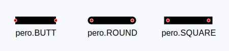
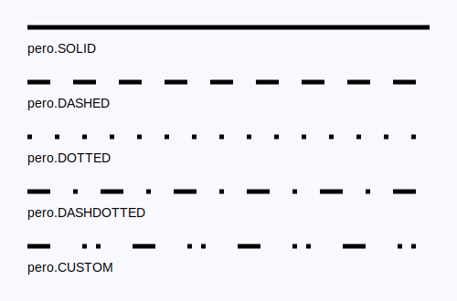
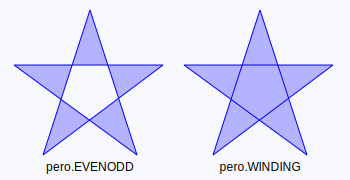
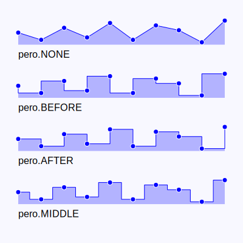
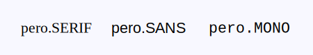
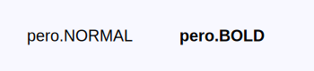
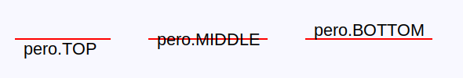
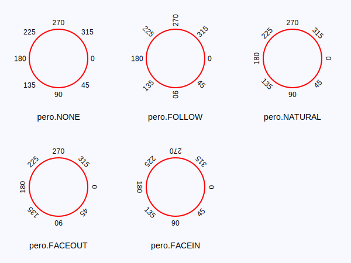
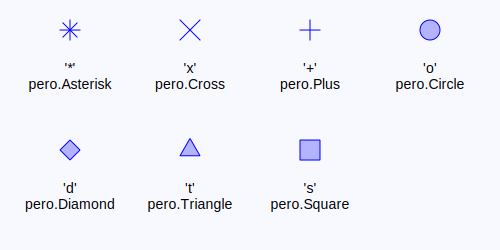
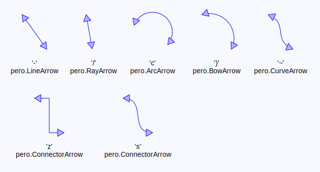

# Enums

There are several constants used throughout the *pero* library to define
angle units, various text properties, line and fill properties,
shortcuts to create predefined glyphs or to position objects relative to
each other.

## Drawing Enums

### <a id="ANGLE" href="#ANGLE">#</a> pero.ANGLE

Used to specify angle units.

- **pero.DEG**: Angle defined in degrees.
- **pero.RAD**: Angle defined in radians.

### <a id="LINE_CAP" href="#LINE_CAP">#</a> pero.LINE_CAP

Used to specify a shape to be used at line ends.

- **pero.BUTT**: A line cuts directly after endpoint.
- **pero.SQUARE**: A line continues beyond endpoint for half its width.
- **pero.ROUND**: A line continues beyond endpoint by half circle to
  form round endpoints.

### <a id="LINE_JOIN" href="#LINE_JOIN">#</a> pero.LINE_JOIN

Used to specify a line join style.

- **pero.BEVEL**: A line join is cutout at the distance of half line width.
- **pero.MITER**: Extends a line join to follow the angle of segments.
- **pero.ROUND**: A line join is filled by circle to form round join.

### <a id="LINE_STYLE" href="#LINE_STYLE">#</a> pero.LINE_STYLE

Used to specify a line style.

- **pero.SOLID**: A line is drawn as a solid line.
- **pero.DOTTED**: A line is drawn as a series of dots and spaces.
- **pero.DASHED**: A line is drawn as a series of dashes and spaces.
- **pero.DASHDOTTED**: A line is drawn as a series of dashes, dots and spaces.
- **pero.CUSTOM**: A line is drawn according to definition given by 'line_dash'.

### <a id="FILL_STYLE" href="#FILL_STYLE">#</a> pero.FILL_STYLE

Used to specify a filling style.

- **pero.SOLID**: Uses current fill color to draw fills.
- **pero.TRANS**: Uses transparent color to draw fills.

### <a id="FILL_RULE" href="#FILL_RULE">#</a> pero.FILL_RULE
Used to specify a path filling rule.

- **pero.EVENODD**: Fills an area according to inside/outside state.
- **pero.WINDING**: Fills a whole enclosed area.

### <a id="LINE_STEP" href="#LINE_STEP">#</a> pero.LINE_STEP

Used to specify a profile line steps style.

- **pero.NONE**: Data points are connected directly by strait line.
- **pero.BEFORE**: A horizontal line starts before data points.
- **pero.AFTER**: A horizontal line starts after data points.
- **pero.MIDDLE**: A horizontal line crosses data points.

## Text Enums

### <a id="FONT_FAMILY" href="#FONT_FAMILY">#</a> pero.FONT_FAMILY

Used to specify a font family, rather then exact font to use.

- **pero.SERIF**: Default serif font will be used (e.g. Times).
- **pero.SANS**: Default sans-serif font will be used (e.g. Arial or Helvetica).
- **pero.MONO**: Default monospaced font will be used (e.g. Courier).

### <a id="FONT_STYLE" href="#FONT_STYLE">#</a> pero.FONT_STYLE

Used to specify a font style to use.

- **pero.NORMAL**: Normal font style variant will be used.
- **pero.ITALIC**: Italic font style variant will be used.

### <a id="FONT_WEIGHT" href="#FONT_WEIGHT">#</a> pero.FONT_WEIGHT

Used to specify a font weight to use. Note that not all values are supported by all backends and the closest value might
be used instead (e.g. pero.HEAVY falls to pero.BOLD).

- **pero.NORMAL**: Normal font weight variant will be used.
- **pero.LIGHT**: Light font weight variant will be used.
- **pero.BOLD**: Bold font weight variant will be used.
- **pero.BLACK**: Black font weight variant will be used.
- **pero.HEAVY**: Heavy font weight variant will be used.
- **pero.SEMIBOLD**: Semi-bold font weight variant will be used.
- **pero.MEDIUM**: Medium font weight variant will be used.
- **pero.ULTRALIGHT**: Ultra-light font weight variant will be used.
- **pero.THIN**: Thin font weight variant will be used.

### <a id="TEXT_ALIGN" href="#TEXT_ALIGN">#</a> pero.TEXT_ALIGN

Used to specify a text horizontal alignment.

- **pero.LEFT**: Uses the text left side as anchor.
- **pero.CENTER**: Uses the text center as anchor.
- **pero.RIGHT**: Uses the text right side as anchor.

### <a id="TEXT_BASELINE" href="#TEXT_BASELINE">#</a> pero.TEXT_BASELINE

Used to specify a text vertical alignment.

- **pero.TOP**: Uses the text top side as anchor.
- **pero.MIDDLE**: Uses the text center as anchor.
- **pero.BOTTOM**: Uses the text bottom side as anchor.

### <a id="TEXT_ROTATION" href="#TEXT_ROTATION">#</a> pero.TEXT_ROTATION

Used to define a way to align text labels around a circle according to their angle.

- **pero.NONE**: Labels are drawn horizontally, aligned to the circle.
- **pero.FOLLOW**: Labels are drawn the way their left or right side follows the circle.
- **pero.NATURAL**: Labels are drawn the way their top or bottom side follows the circle.
- **pero.FACEOUT**: Labels are drawn the way their bottom side follows the circle.
- **pero.FACEIN**: Labels are drawn the way their top side follows the circle.

## Glyphs Enums

### <a id="MARKER" href="#MARKER">#</a> pero.MARKER

Used to specify a marker glyph type shortcut for pero.MarkerProperty.

- Use the "*" character for pero.Asterisk marker.
- Use the "o" character for pero.Circle marker.
- Use the "x" character for pero.Cross marker.
- Use the "+" character for pero.Plus marker.
- Use the "t" character for pero.Triangle marker.
- Use the "s" character for pero.Square marker.
- Use the "d" character for pero.Diamond marker.
- Use the "p" character for pero.Pentagon marker.
- Use the "h" character for pero.Hexagon marker.

### <a id="ARROWS" href="#ARROWS">#</a> pero.ARROWS

Used to specify an arrow type shortcut to create pero.Arrow.

- Use the "c" character for pero.ArcArrow arrow.
- Use the ")" character for pero.BowArrow arrow.
- Use the "~" character for pero.CurveArrow arrow.
- Use the "-" character for pero.LineArrow arrow.
- Use the "/" character for pero.RayArrow arrow.
- Use the "z" character for line pero.ConnectorArrow arrow.
- Use the "s" character for curve pero.ConnectorArrow arrow.

### <a id="HEADS" href="#HEADS">#</a> pero.HEADS

Used to specify an arrow head type shortcut for pero.HeadProperty.

- Use the "o" character for pero.CircleHead arrow head.
- Use the "\|" character for pero.LineHead arrow head.
- Use the "<\|" or "\|>" characters for pero.NormalHead arrow head.
- Use the "<" or ">" characters for pero.OpenHead arrow head.
- Use the "<<" or ">>" characters for pero.VeeHead arrow head.

## Position Enums

### <a id="ORIENTATION" href="#ORIENTATION">#</a> pero.ORIENTATION

Used to specify an object orientation.

- **pero.HORIZONTAL**
- **pero.VERTICAL**

### <a id="POSITION_LR" href="#POSITION_LR">#</a> pero.POSITION_LR

Used to specify an object horizontal position.

- **pero.LEFT**
- **pero.RIGHT**

### <a id="POSITION_LRC" href="#POSITION_LRC">#</a> pero.POSITION_LRC

Used to specify an object horizontal position.

- **pero.LEFT**
- **pero.RIGHT**
- **pero.CENTER**

### <a id="POSITION_TB" href="#POSITION_TB">#</a> pero.POSITION_TB

Used to specify an object vertical position.

- **pero.TOP**
- **pero.BOTTOM**

### <a id="POSITION_TBC" href="#POSITION_TBC">#</a> pero.POSITION_TBC

Used to specify an object vertical position.

- **pero.TOP**
- **pero.BOTTOM**
- **pero.CENTER**

### <a id="POSITION_LRTB" href="#POSITION_LRTB">#</a> pero.POSITION_LRTB

Used to specify an object cross position.

- **pero.LEFT**
- **pero.RIGHT**
- **pero.TOP**
- **pero.BOTTOM**

### <a id="POSITION_LRTBC" href="#POSITION_LRTBC">#</a> pero.POSITION_LRTBC

Used to specify an object cross position.

- **pero.LEFT**
- **pero.RIGHT**
- **pero.TOP**
- **pero.BOTTOM**
- **pero.CENTER**

### <a id="POSITION_IOC" href="#POSITION_IOC">#</a> pero.POSITION_IOC

Used to specify an object relative position.

- **pero.INSIDE**
- **pero.OUTSIDE**
- **pero.CENTER**

### <a id="POSITION_SEM" href="#POSITION_SEM">#</a> pero.POSITION_SEM

Used to specify an object relative position.

- **pero.START**
- **pero.END**
- **pero.MIDDLE**

### <a id="POSITION_TL" href="#POSITION_TL">#</a> pero.POSITION_TL

Used to specify an object corner position.

- **pero.TOP**
- **pero.LEFT**

### <a id="POSITION_TR" href="#POSITION_TR">#</a> pero.POSITION_TR

Used to specify an object corner position.

- **pero.TOP**
- **pero.RIGHT**

### <a id="POSITION_BL" href="#POSITION_BL">#</a> pero.POSITION_BL

Used to specify an object corner position.

- **pero.BOTTOM**
- **pero.LEFT**

### <a id="POSITION_BR" href="#POSITION_BR">#</a> pero.POSITION_BR

Used to specify an object corner position.

- **pero.BOTTOM**
- **pero.RIGHT**

### <a id="POSITION_COMPASS" href="#POSITION_COMPASS">#</a> pero.POSITION_COMPASS

Used to specify an object compass-like position.

- **pero.N**
- **pero.NW**
- **pero.NE**
- **pero.S**
- **pero.SW**
- **pero.SE**
- **pero.W**
- **pero.E**
